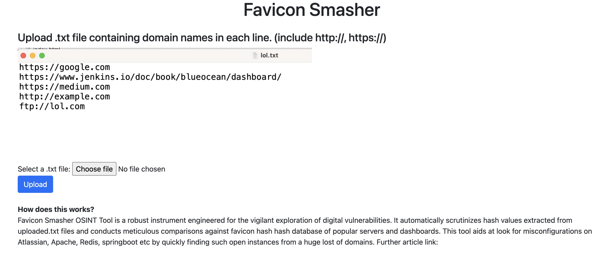

# favicon-smasher

How does this works?
Favicon Smasher OSINT Tool is a robust instrument engineered for the vigilant exploration of digital vulnerabilities. It automatically scrutinizes hash values extracted from uploaded.txt files and conducts meticulous comparisons against favicon hash hash database of popular servers and dashboards. This tool aids at look for misconfigurations on Atlassian, 
Apache, Redis, springboot etc by quickly finding such open instances from a huge lost of domains. 

Upload a .txt file having the valid domains. Smasher will try to match with hash list and display any matches. 

Further article link:

Credits: @0xAsm0d3us for the hash list.
